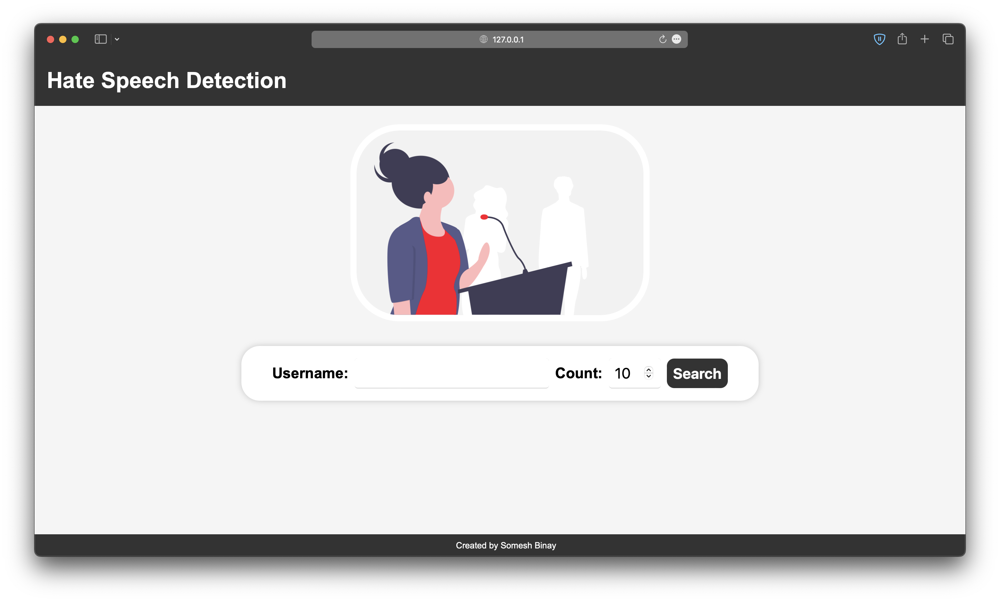

# Twitter Toxicity Detection App

This is a Django web application that allows users to search for a Twitter user's recent tweets and get a toxicity score for each tweet using a pre-trained logistic regression model.

## Screenshots



## Getting Started

Get Twitter API keys from [here](https://developer.twitter.com/en/docs/twitter-api/getting-started/getting-access-to-the-twitter-api).
To get started with this project, follow these steps:

```bash
git clone https://github.com/someshbinay21/twitter-toxicity-detection-app.git
cd twitter-toxicity-detection-app
pip install -r requirements.txt
touch .env
echo "CONSUMER_KEY=<your_twitter_api_consumer_key>" >> .env # replace <your_twitter_api_consumer_key> with your Twitter API consumer key
echo "CONSUMER_SECRET=<your_twitter_api_consumer_secret>" >> .env # replace <your_twitter_api_consumer_secret> with your Twitter API consumer secret
echo "ACCESS_TOKEN=<your_twitter_api_access_token>" >> .env # replace <your_twitter_api_access_token> with your Twitter API access token
echo "ACCESS_TOKEN_SECRET=<your_twitter_api_access_token_secret>" >> .env # replace <your_twitter_api_access_token_secret> with your Twitter API access token secret
python manage.py runserver 127.0.0.1:8080 # you can use any port you want
```

Navigate to [http://127.0.0.1:8000/](http://127.0.0.1:8000/) in your web browser to use the app.

If you want to access my old version of this app, you can find it [here](./old/README.md).

## Project Structure

```txt
hate_speech_detector/
├── hate_speech_detector/
│   ├── __init__.py
│   ├── asgi.py
│   ├── settings.py
│   ├── models.py
│   ├── views.py
│   ├── urls.py
│   └── wsgi.py
├── models/
│   └── hate_speech_model.csv
├── static/
│   └── css/
│       └── style.css
|   └── images/
│       └── hate_speech.png
├── templates/
│   ├── base.html
│   ├── results.html
│   └── search.html
├── old/ 
│   ├── main.py
│   ├── .env
│   └── models/
│       └── hate_speech_model.csv
├── README.md
├── .env
├── .gitignore
├── db.sqlite3
├── manage.py
└── requirements.txt
```

## How It Works

This web application allows users to search for a Twitter user's recent tweets and get a toxicity score for each tweet using a pre-trained logistic regression model. Here's how it works:

1. The user enters a Twitter username and the number of tweets they want to search for on the search page.
2. When the user clicks the "Search" button, the application sends a request to the Twitter API to retrieve the user's recent tweets.
3. The application then iterates through each tweet and passes its text to the pre-trained logistic regression model to get a toxicity score.
4. The toxicity score is displayed alongside the tweet text in the results page.
5. The user can then review the toxicity scores for each tweet and assess the toxicity of the user's recent tweets.

The model was trained to classify text as  toxic or non-toxic based on the presence of certain words and phrases in the text. The model was then saved to a CSV file  that was downloaded and used in a Django application.
The program uses the Tweepy library to interact with the Twitter API and the Python dotenv library to load environment variables from an .env file. The Scikit-learn library is used for text preprocessing and classification, and the Pandas library is used to load the pre-trained model from a CSV file. Finally, Django is used to build the web application and handle user requests.

## How to Use

1. On the search screen, enter a Twitter username and the quantity of tweets you want to look for.
2. Select "Search" from the menu.
3. The app will show a list of the user's most recent tweets along with a score for their toxicity based on a logistic regression model that has already been developed.

## Dependencies

This project was built using the following libraries:

- [Django](https://www.djangoproject.com/)
- [Tweepy](https://www.tweepy.org/)
- [Pandas](https://pandas.pydata.org/)
- [Scikit-learn](https://scikit-learn.org/stable/)
- [Matplotlib](https://matplotlib.org/)
- [Seaborn](https://seaborn.pydata.org/)
- [Python-dotenv](https://pypi.org/project/python-dotenv/)
- [NumPy](https://numpy.org/)

For old version:

- [Tkinter](https://docs.python.org/3/library/tkinter.html)

## Author

- [**Somesh Binay**](https://github.com/someshbinay21)
